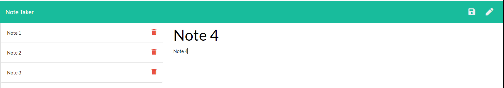

# NoteTaker

## Description
______________________________________________________________________________________________________________________________________________________

This Express node.js Note Taker allows you to create and store notes. Future functionality will have the delete notes function working.

## Installation
______________________________________________________________________________________________________________________________________________________
In order to use the note take app - 
1. Use Git Bash or the VS terminal to run the following:  
   * Run 'npm i' to pull down the npm node package manager
   * Run 'npm init -y' to install package.json
   * Run 'npm i express' to install the express node.js package
2. Make any updates needed
3. Follow directions to deploy to Heroku, if desired

## Usage
______________________________________________________________________________________________________________________________________________________
This program can be used with permission to generate notes that include a notes title and the note description.

Go to the [Note Take App](https://desolate-peak-65537.herokuapp.com/) to try it out!

* Use the Save 💾 icon in the top right after creating your note ot the left-hand column.
* Click on a saved note to view it.
* Use the ✏ icon in the top right to create a new note.

## License
______________________________________________________________________________________________________________________________________________________

## Contact
______________________________________________________________________________________________________________________________________________________
If you have any questions, please contact me at:\
✉️[Email](mailto:hrkoren@gmail.com)\
📂[GitHub](<https://github.com/hrkoren>)